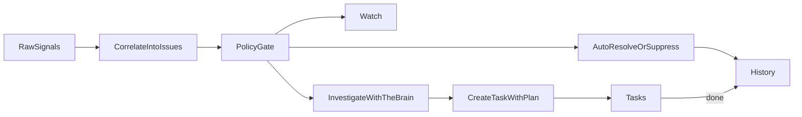

# Pinky PRD

## Product Summary

`Pinky` is a greenfield multi-cluster operations product. It helps operators turn noisy cluster signals into structured human work. Its built-in SRE agent, `The Brain`, investigates issues, prepares plans, recommends or executes safe actions, and keeps the operator focused on the work that actually matters.

`Pinky` is not a raw alert console and not a generic chat tool. It is a task-first operations product.

## Product Vision

Help operators answer four questions instantly:

1. What should I do now?
2. What is The Brain doing right now?
3. What already happened?
4. What raw signals exist?

## Product Principles

- Task-first, not alert-first
- Async-first, worker-executed, workflow-driven runtime
- Deterministic policy before AI reasoning
- User RBAC on target clusters whenever possible
- Explainability before automation
- Ambient AI presence, not a hidden chat widget
- Earned autonomy, not blanket auto-fix
- Durable state over in-memory convenience
- Same-origin, secure, session-based product architecture
- Extensible by operators via markdown definitions, not code changes
- Fun brand, serious operations UX

## Brand

- Product/platform name: `Pinky`
- SRE agent name: `The Brain`

## Core Users

### Platform Operators

- manage multiple clusters
- need trustable remediation and audit trails
- care about auth, approvals, and blast radius

### SREs / Incident Responders

- need fast issue triage
- want evidence, plans, and next steps
- need history and execution visibility

### Engineering Leads / Reliability Owners

- want durable operational history
- want to measure issue volume, automation quality, and task load

### Pinky Admins

- register and remove clusters from the shared registry
- manage observer bindings and fleet integration
- control automation policy and risk classes

## Problem Statement

Existing operations tools force users to bounce between:

- raw alerts
- dashboards
- investigations
- task lists
- chat
- historical analysis

That creates too much cognitive overhead and makes it hard to know whether a signal already has a plan, already self-healed, or truly needs a person.

## Goals

- Convert noisy operational signals into human-actionable tasks
- Make The Brain visible as an operator teammate, not a hidden assistant
- Support multi-cluster operations with user-scoped access
- Bundle a purpose-built UI with the backend and worker runtime
- Provide a durable audit trail for investigations, approvals, and actions
- Minimize wasted LLM calls through deterministic gating, caching, and tiered models

## Non-Goals

- Strict compatibility with legacy `pulse-agent` API contracts
- Generic Kubernetes resource browsing layer
- All legacy toolbox/admin surface in v1
- Immediate support for every OpenShift day-2 workflow on day one
- Uncontrolled auto-remediation
- Multi-tenant SaaS platform or multiple internal workspaces/teams with separate tenancy boundaries
- Generic dashboard-builder or toolbox platform as the v1 product core

## Core Product Surfaces

### Tasks

The main workspace. Contains only human-actionable work with a plan. Completed tasks move to History; Tasks does not maintain a persistent done queue.

### Watch

Shows what The Brain is analyzing, suppressing, auto-remediating, or deciding not to escalate.

### History

Shows completed tasks, suppressions, approvals, rollbacks, and postmortems. This is the canonical surface for all completed work. Retention policy: 90 days online; older records are archived or exported.

### Alerts

Shows raw signals and observability context, separate from the work queue.

## Core Product Flow

## Key Requirements

### 1. Task-first workflow

- Raw signals do not appear as task rows
- A task exists only after The Brain can attach a coherent plan
- Low-confidence issues stay in Watch
- Every task must include `why now`, evidence, a recommended next step, approval state, and an agent-prepared plan
- The visible task lifecycle is human-centered: `ready`, `accepted`, `in_progress`, `blocked`, `waiting_for_approval`, `done`
- Completed tasks move to History as the canonical completed-work surface; Tasks may show transient completion feedback but must not maintain a persistent done queue
- Recurrence must either reopen the same task or create a linked follow-up task, never vanish into history silently
- Tasks are team-visible but person-ownable, with explicit claim, reassign, and approval semantics
- If a user loses binding access to the cluster behind an assigned task, the task must return to the team queue (reassignment-on-binding-loss)
- Alert-derived and resource-derived observations that refer to the same underlying problem must correlate into a single issue, not create parallel incidents

### 2. Multi-cluster control plane

- Users can connect multiple clusters
- The product can observe across clusters
- Sensitive reads/writes use the user's own cluster permissions through cluster identity bindings
- Pinky must include a first-class cluster registry/onboarding model, not just a cluster selector
- Background observation identity and user execution identity must be modeled separately
- Tasks, issues, history, and alerts must all be cluster-aware and tenancy-aware
- Admins register clusters into a shared registry using ACM/OCM fleet-management integration; v1 cluster registration requires a concrete ACM/OCM adapter
- Users create their own cluster bindings through per-cluster OAuth/login or brokered/admin-managed binding flows
- Manual token or kubeconfig entry is not a default v1 path
- Live tasks, watch state, and detailed issue/workspace data are only visible for clusters the user currently has a valid binding for
- Historical records remain visible after binding loss, but new actions remain blocked until access is restored

#### External OIDC requirement for fleet scale

- For deployments with more than 5 clusters, external OIDC (via OpenShift's external OIDC feature) is a hard requirement for cluster identity bindings
- Per-cluster OAuth login is only acceptable for deployments with 5 or fewer clusters
- One external OIDC provider trusted by all managed clusters gives a single login that provides bindings across the fleet
- The binding acquisition flow should detect cluster count and enforce/recommend external OIDC when >5 clusters are registered

#### Cluster removal edge cases

- If a cluster is removed from the registry mid-execution, in-flight executions targeting that cluster must be cancelled or failed with an explicit reason
- Active tasks tied to a removed cluster must be archived or closed, not left in an actionable state
- Historical records for removed clusters remain available in read-only form for audit
- Watch entries for removed clusters must be cleared from live views

#### Network partition and partial binding states

- If a cluster becomes unreachable (network partition), observer loops must degrade gracefully: mark the cluster as unreachable, stop emitting stale observations, and surface the partition state in Watch and cluster status
- Partial binding states (e.g., observer binding valid but user binding expired) must be handled explicitly: observer reads continue, user-sensitive reads and writes are blocked, and the UI must indicate which capabilities are degraded
- Tasks for unreachable clusters remain visible with a degraded indicator but cannot be actioned until connectivity is restored

### 3. Authentication and access

- OpenShift OAuth support
- Optional external OIDC support
- Proper session management
- Explicit cluster identity bindings
- No raw cluster tokens in the browser
- The backend, not the browser, forwards user-scoped cluster credentials when required
- `401` session or binding expiry must be handled differently from `403` forbidden access
- Background observation may use a dedicated observer identity, but user-triggered reads/writes must not silently fall back to more privileged identities
- Product accounts should auto-link across OpenShift and external OIDC when the email is verified and matches
- Standard non-sensitive reads may use a read-only observer identity
- Sensitive reads and all writes must use the user's own cluster identity

#### Observer identity model

- The observer identity is a read-only service account per cluster, used for continuous background observation and standard non-sensitive reads
- The observer identity must never be used for mutations, sensitive reads (secrets, exec, private app data), or any action that should carry the user's RBAC
- Observer binding health must be tracked and surfaced: healthy, degraded, or failed
- Observer credentials and user execution credentials must be stored and rotated independently

#### Authorization layer breakdown

Three distinct authorization layers, evaluated in order:

1. **Product authorization** — does the principal have access to this Pinky product feature?
2. **Cluster authorization** — does the principal have a valid binding for this cluster, and does the operation type (observer-read, user-sensitive-read, user-write) match the binding scope?
3. **Execution authorization** — is the specific execution action permitted given the risk class, approval state, and session/binding freshness?

Execution authorization classes:

- Product-authenticated read
- Observer read
- User-sensitive read
- Cluster-user write
- Admin-only control-plane action

#### Cluster binding states

Every cluster identity binding must be in exactly one of these states:

- `missing` — no binding exists for this principal/cluster pair
- `valid` — binding is active and fresh
- `expiring` — binding is valid but approaching expiry; UI should prompt proactive refresh
- `expired` — binding has expired; user-sensitive reads and writes are blocked until reauthentication
- `revoked` — binding has been explicitly revoked; assigned tasks return to the team queue

### 4. Safe automation

- Approvals for risky actions
- Execution context per action
- Verification after action
- Explicit history of what The Brain did and why
- Autonomy should be earned from verified outcomes, not assumed by category alone
- Approvals should apply to a concrete, immutable change-set or execution plan
- All actions need outcome tracking, verification, and rollback-aware history
- Approval is invalidated whenever the issue, target resources, or exact change-set changes before execution
- Very high-risk actions always require fresh reauthentication, while lower-risk actions only require it when session or binding freshness is stale

### 5. Performance and cost discipline

- Deterministic policy before LLM
- Tiered models (utility, interactive, reasoning, synthesis)
- Reusable investigation artifacts
- Execution-level cost telemetry
- Avoid duplicate investigation of the same issue/evidence bundle
- Release quality must be guarded with eval baselines, replay fixtures, and regression gates
- Telemetry must cover tool usage, execution quality, override rate, and confidence calibration accuracy (predicted confidence vs. actual outcome correctness)

### 6. Hydrated workspaces and topology-guided investigation

- Opening a task should hydrate a live workspace from stored investigation/plan artifacts with staleness and timeout guards
- Topology should be question-driven and perspective-based, not a generic always-on graph
- Pinky should support impact/blast-radius style investigation views as part of operator workflows
- Hydrated workspaces must degrade gracefully when live reads are unavailable due to expiry, missing bindings, or cluster removal

### 7. Observation and issue correlation

- Alert-derived observations and resource-derived observations that refer to the same underlying problem must correlate into a single issue, not create parallel incidents
- Issue identity must not depend on mutable titles; use stable fingerprinting based on cluster, resource, and signal type
- Duplicate observations must merge into one issue
- Low-confidence/noisy observations must be filtered before expensive reasoning
- Existing recent investigations should be reusable where evidence/fingerprint still matches

### 8. Projection and reconciliation

- **Temporal** is authoritative for in-flight workflow and execution progress
- **Postgres** is authoritative for issues, work items, history, and query projections
- A projector must consume workflow events and write idempotent, replay-safe projections to Postgres
- Projector lag must be observable via metrics
- UI queries must read only from Postgres projections, never from Temporal directly
- Execution detail views may combine projected state with resumable execution-event streams

### 9. Stream resilience

- SSE streams must emit periodic heartbeat events distinct from domain events
- Clients must support resume from cursor / `Last-Event-ID` for execution and history streams
- General task/watch projection streams may use refetch-on-reconnect semantics
- If a product session expires during an active SSE stream, the stream must terminate with an explicit `auth-expired` event and the UI must prompt reauthentication
- If a cluster binding expires during an active stream, the stream must emit a `binding-expired` event for the affected cluster scope

### 10. Integrations (v1 scope)

- Inbound: PagerDuty/OpsGenie webhook ingestion as observation sources, so pages are correlated with Pinky issues
- Outbound: Slack/Teams notifications for task creation, approval requests, and execution outcomes
- Bidirectional task-state sync with incident management tools is deferred to v2
- On-call roster integration (PagerDuty schedules) for shift-aware task assignment is deferred to v2

### 11. Retention and archival

- History, audit, and execution records must be kept online for 90 days
- Records older than 90 days must be archived or exported
- Whether the 90-day window applies uniformly or becomes policy-configurable is deferred

## Runtime Model

Pinky is async-first, worker-executed, and workflow-driven:

- API handlers, streams, orchestration boundaries, and persistence paths are asynchronous by default
- Long-running, blocking, or compute-heavy work runs as Temporal activities or worker tasks, never inline in the request path
- The web/API layer coordinates and streams state; it does not perform full investigations or remediation logic inside request handlers
- Observer loops, execution workers, and projectors are isolated runtime roles with explicit concurrency and timeout policy

If a task cannot complete quickly and deterministically within a normal request budget, it must become a durable workflow step or worker-executed activity.

## Extensibility Model

Pinky is extensible via **markdown definitions** — the same pattern as Claude Code skills. Frontmatter carries structured config, body carries LLM-readable instructions. Definitions ship as files in the repo (git-versioned, PR-reviewable) and can be added/overridden at runtime via API without redeploying.

### Definition kinds
- **Scanners** — what to observe (resource types, check conditions, evidence to gather)
- **Tools** — what The Brain can use (kubectl, helm, prometheus-query, datadog-query)
- **Skills** — how The Brain approaches problems (investigation strategy, recommendation framework)
- **Pipelines** — how signals flow through the system (triage steps, gating logic)
- **Policies** — declarative triage rules (suppress, observe, investigate, auto-resolve)
- **Approval policies** — per-cluster/namespace/risk approval chains
- **Redaction rules** — custom PII/sensitive data patterns to strip before LLM prompts

### Tool auth model
- Tools declare what auth they need in frontmatter (`authz_class` for cluster tools, `service` for external tools)
- The runtime resolves credentials at execution time — tools never carry or see raw credentials
- External service tools (Prometheus, Datadog, Grafana) use **service bindings** — encrypted credentials registered by admins
- Credential resolution failures produce explicit errors, never silent fallback to higher-privilege identities

### CLI
- A thin CLI wrapping the REST API for automation and CI: `pinky tasks list`, `pinky definitions create -f scanner.md`, `pinky watch`
- API token auth for non-interactive use (CI, scripts, service accounts)
- CLI validates API contract completeness — every operator workflow must be API-accessible

### Work item extensibility
- Work items and issues support `labels` (map[string]string) for filtering and categorization
- Work items and issues support `annotations` (map[string]string) for extended metadata
- Work items and issues support optional `runbook_url` for linking external runbooks

### Domain event bus
- Every significant state transition emits a domain event (task created, approval requested, execution completed, etc.)
- External systems subscribe to events via webhook subscriptions with pattern filtering
- v1 ships with Slack, Teams, and generic JSON formatters
- Replaces hardcoded integration code — all outbound notifications flow through the event bus

### MCP adapter (future)
- The MD definition system is primary. MCP is available as an optional adapter kind for external vendor tooling.
- MCP tools appear in the same tool registry as MD-defined tools — The Brain treats them identically.

## UI Design Overview

The product should feel like a serious operations workspace with playful branding, not a novelty app.

### Navigation

- Tasks
- Watch
- History
- Alerts
- Settings / Cluster Access

The top-level cluster selector should use hybrid semantics:

- Overview surfaces may show multi-cluster summaries
- Detailed task/workspace/execution views are cluster-scoped

### Task detail

Each task should answer:

1. What happened?
2. Why is this a task?
3. What does The Brain recommend?
4. What should I do next?
5. What happened before?

Task detail should open as a real hydrated workspace, not just a shallow drawer. It should be backed by stored investigation and plan artifacts that are refreshed on open with bounded live hydration.

### Agent presence

The Brain should be present in task detail, watch views, and execution history, but should not overwhelm the core UI with chat-first interactions.

The Brain should feel ambient and visible. Watch and task detail should expose what it is doing, what tools it used, and why it recommended a next step, without forcing the operator into a chat-first workflow.

The full UI design is captured in:

- `./2026-05-01-pinky-ui-design.md`

## Security Requirements

- HTTP-only secure product sessions
- CSRF protection
- Strict CSP from day one
- Explicit authz classes for product, cluster, and execution actions (three-layer model)
- Encrypted cluster binding/session material
- Audit trail for auth, approvals, and execution
- No LLM access to secrets or raw tokens
- No raw provider or cluster access tokens in browser storage
- Backend token forwarding rules must be explicit, auditable, and never leak into prompts, logs, or artifacts
- Observer credentials and user execution credentials must be isolated
- Sensitive reads such as secrets, exec-like access, and private application data must not use the observer identity

## Resilience Requirements

- Explicit timeouts for sessions, streams, LLM calls, jobs, approvals, verification, and integrations
- Retry/backoff policy
- Durable workflow state
- No subscriber-owned control plane behavior
- Live workspace hydration must degrade gracefully when fresh data is unavailable
- Executions must survive reconnects and session refreshes without losing durable history
- If a session or cluster binding expires during execution, the in-flight execution may continue if already authorized, but new user actions must be blocked until reauthentication
- SSE streams must emit heartbeats, support resume from cursor, and emit explicit `auth-expired` / `binding-expired` events on credential loss

## Success Metrics

### Product

- Time from signal to task creation
- Task acceptance/completion rate
- Mean time to first recommended action
- Approval turnaround time
- Cluster binding acquisition success rate
- Cluster registry onboarding time

### Quality

- False-positive rate
- Duplicate issue rate
- Auto-fix verification success rate
- Recurrence rate after "done"
- Operator override rate
- Approval rejection rate
- Issue-to-task conversion precision
- Confidence calibration accuracy: predicted confidence percentile vs. actual outcome correctness rate

### Efficiency

- LLM calls per issue
- Token cost per investigation
- Cache hit rate on investigation reuse
- Proportion of signals resolved without expensive reasoning
- Repeated-investigation avoidance rate
- Percentage of executions satisfied by reusable artifacts instead of fresh reasoning

## Scale Targets

- 10–100 clusters
- Dozens to low hundreds of users
- Task freshness target: under 10 seconds
- Watch/execution update latency target: under 10 seconds

## Release Phases

### Phase 1

- Monorepo
- Auth/session/security baseline
- Task/watch/history/alerts shell
- Observation + issue correlation
- Cluster registry with ACM/OCM adapter
- Cluster binding lifecycle (missing/valid/expiring/expired/revoked)
- External OIDC enforcement for >5 clusters

### Phase 2

- Durable workflows for investigations and approvals
- Task creation and execution flows
- LLM efficiency controls
- Projection/reconciliation pipeline (Temporal -> Postgres)
- Stream resilience (heartbeat, resume, auth-expired events)
- PagerDuty/OpsGenie inbound webhook integration
- Slack/Teams outbound notifications

### Phase 3

- Scanner quality/noise reduction expansion
- Richer OpenShift day-2 coverage
- On-call roster integration and shift handoff
- Bidirectional incident management sync
- Migration/cutover options if needed
- Confidence calibration tuning and outcome feedback loops

## Cross-References

- SDS: `./2026-05-01-pinky-sds.md`
- UI Design: `./2026-05-01-pinky-ui-design.md`
- Architecture Decisions: `./2026-05-01-pinky-architecture-decisions.md`
- Implementation Plan: `../plans/2026-05-01-pinky-platform.md`

